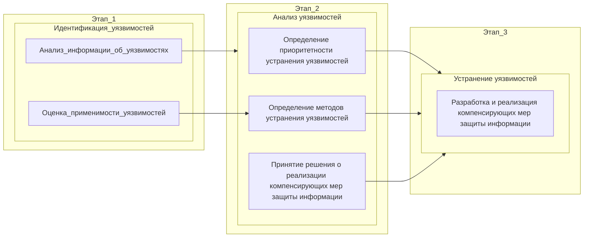

###### # Vulnerability Management Regulations

# РЕГЛАМЕНТ УПРАВЛЕНИЯ УЯЗВИМОСТЯМИ И&nbsp;КОНТРОЛЯ ОБНОВЛЕНИЙ АВТОМАТИЗИРОВАННЫХ / ИНФОРМАЦИОННЫХ СИСТЕМ

## 1.	Назначение

1.1.	Настоящий Регламент управления уязвимостями и контроля обновлений автоматизированных/информационных систем АО&nbsp;«Газпром шельфпроект» (далее – Регламент) устанавливает правила контроля наличия уязвимостей на ресурсах АО&nbsp;«Газпром шельфпроект», порядок реагирования на них и правила поиска и установки обновлений на ресурсы АО&nbsp;«Газпром шельфпроект»;

1.2.	Настоящий Регламент управления уязвимостями в АО&nbsp;«Газпром шельфпроект» (далее – Регламент) разработан в соответствии с подпунктом 4 пункта 8 Положения о Федеральной службе по техническому и экспортному контролю, утверждённого Указом Президента Российской Федерации от 16.08.2004 № 1085;

## 2.	Область применения

2.1.	Действие Регламента распространяется на работников подразделений АО&nbsp;«Газпром шельфпроект» в сфере информационных технологий, информационной безопасности, связи, промышленной автоматизации и метрологии;

2.2.	Владельцем процессов управления уязвимостями и контроля обновлений является руководитель Управления информационной безопасности;

2.3.	Контроль исполнения требований настоящего Регламента возлагается Управление информационной безопасности;

2.4.	Иные работники АО&nbsp;«Газпром шельфпроект» обязаны соблюдать требования Регламента и нести ответственность за их нарушение в рамках своих должностных обязанностей.

## 3.	Общие положения.

3.1.	Регламент определяет состав и содержание работ по анализу и устранению уязвимостей (далее – управление уязвимостями), выявленных в программных, программно-аппаратных средствах информационных систем, информационно-телекоммуникационных сетей, автоматизированных систем управления, информационно-телекоммуникационных инфраструктурах центров обработки данных, на базе которых функционируют эти системы и сети (далее – информационные системы);

3.2.	Настоящий Регламент обязателен к применению при принятии мер по устранению уязвимостей программных, программно-аппаратных средств информационных систем в соответствии с требованиями о защите информации, содержащейся в информационных системах, требованиями по обеспечению безопасности значимых объектов критической информационной инфраструктуры АО&nbsp;«Газпром шельфпроект» (далее – Общество), а также иными нормативными правовыми актами и методическими документами ФСТЭК России;

3.3.	Управление уязвимостями программных, программно-аппаратных средствах информационных систем, информационно-телекоммуникационных сетей, автоматизированных систем управления, информационно-телекоммуникационных инфраструктурах центров обработки данных, включая программно-аппаратные средства защиты информации обеспечивается с учетом эксплуатационной документации на них, а также рекомендаций разработчиков.

## 4.	Нормативные ссылки

 - Методический документ «Методика оценки уровня критичности уязвимостей программных, программно-аппаратных средств», утвержден Федеральной службе по техническому и экспортному контролю от 28.10.2022;
 - Методический документ «Методика тестирования обновлений программных, программно-аппаратных средств, утвержден Федеральной службе по техническому и экспортному контролю от 28.10.2022;
 - Национальный Стандарт Российской Федерации ГОСТ Р 50922-2006 «Защита информации. Основные термины и определения»;
 - Национальный Стандарт Российской Федерации ГОСТ Р 56546-2015. «Защита информации. Уязвимости информационных систем. Классификация уязвимостей информационных систем»;
 - Национальный Стандарт Российской Федерации ГОСТ Р 56545-2015 «Защита информации. Уязвимости информационных систем. Правила описания уязвимостей»;
 - Национальный Стандарт Российской Федерации ГОСТ Р 56546-2015 «Защита информации. Уязвимости информационных систем. Классификация уязвимостей информационных систем»;
 - Национальный Стандарт Российской Федерации ГОСТ Р 59547-2021 «Мониторинг информационной безопасности»;
 - Национальный Стандарт Российской Федерации ГОСТ Р 59709-2022 «Защита информации. Управление компьютерными инцидентами. Термины и определения»; 
 - Стандарт организации ПАО «Газпром» Р Газпром 4.2-0-006-2013 «Типовые нормативные и организационно-распорядительные документы дочернего общества (организации) ОАО «Газпром» в области информационной безопасности»;
 - ISO/IEC 27001:2022 «Information security, cybersecurity and privacy protection – Information security management systems – Requirements»; 
 - Национальный Стандарт Российской Федерации ГОСТ Р 57580.1-2017 «Безопасность финансовых (банковских) операций. Защита информации финансовых организаций. Базовый состав организационных и технических мер»;
и иными национальными стандартами в области защиты информации и обеспечения информационной безопасности. 

## 5.	Термины, определения и сокращения

В Регламенте используются термины и определения, не установленные национальными либо отраслевыми стандартами:

**УИБ** – подразделение: Управление информационной безопасности АО&nbsp;«Газпром шельфпроект»;

**УИТИ** - подразделение: Управление по информационно-технологическому инфраструктуре АО&nbsp;«Газпром шельфпроект»;

**УПА и М** - подразделение: Управление промышленной автоматизации и метрологии АО&nbsp;«Газпром шельфпроект»;

**CVSS** – (англ. Common Vulnerability Scoring System) – общая система оценки уязвимостей

**CMDB** – (англ. Configuration Management Database) – единое хранилище, в котором содержатся информация об ИТ-оборудовании (серверах, ноутбуках, лицензиях), производственных машинах или офисной технике. Кроме этого, в неё включены логические компоненты: виртуальные машины, сетевые интерфейсы, потоки данных;

**PoC** – (англ. Proof of Concept, проверка концепции) – моделирование эксплуатации уязвимости 

## 6.	Организация процесса управления уязвимостями

Процесс управления уязвимостями организуется для всех информационных (автоматизированных) систем Общества и должен предусматривать постоянную и непрерывную актуализацию сведений об уязвимостях и элементах информационных (автоматизированных) систем. При изменении статуса уязвимостей (применимость к информационным системам, наличие исправлений, критичность) должны корректироваться способы их устранения.

### 6.1.	Процесс управления уязвимостями информационной безопасности включает в себя следующие основные этапы: 

Этап 1. Идентификация уязвимостей. 

Осуществление мониторинга уязвимостей и уровня их критичности, в том числе оценки их применимости, применительно к информационным системам Общества, на основании данных, получаемых из внешних и внутренних источников, и принятие решений по их последующей обработке.

Этап 2. Анализ уязвимостей. 
Определение методов и приоритетности устранения уязвимостей: обновление программного обеспечения и (или) применение компенсирующих мер защиты информации.

Этап 3. Устранение уязвимостей.

Принятие мер, направленных на устранение или исключение возможности использования (эксплуатации) выявленных уязвимостей.

### 6.2.	Процесс управления уязвимостями связан с другими процессами и процедурами деятельности Общества:

 - мониторинг информационной безопасности – процесс постоянного наблюдения и анализа результатов регистрации событий безопасности и иных данных с целью выявления нарушений безопасности информации, угроз безопасности информации и уязвимостей;
 - оценка защищенности – анализ возможности использования обнаруженных уязвимостей для реализации компьютерных атак на информационные системы органа (организации);
 - оценка угроз безопасности информации – выявление и оценка актуальности угроз, реализация (возникновение) которых возможна в информационных системах Общества;
 - управление конфигурацией – контроль изменений, состава и настроек программного и программно-аппаратного обеспечения информационных систем;
 - управление обновлениями – приобретение, анализ и развертывание обновлений программного обеспечения в Обществе;
 - применение компенсирующих мер защиты информации – разработка и применение мер защиты информации, которые применяются в информационной системе взамен отдельных мер защиты информации, подлежащих реализации в соответствии с требованиями по защите информации, в связи с невозможностью их применения.

## 7.	Участники процесса управления уязвимостями

7.1.	Подразделение, осуществляющее функции по обеспечению информационной безопасности (Управление информационной безопасности). 

7.2.	Подразделение, ответственное за внедрение и эксплуатацию информационно-технологической инфраструктуры (далее – Управление по информационно-технологической инфраструктуре). 

7.3.	Подразделение, ответственное за внедрение и эксплуатацию и сопровождение информационных систем (далее – Управление по информационно-технологическому обеспечению). 

7.4.	Подразделение, ответственное за внедрение и эксплуатацию автоматизированных систем управления (далее – Управление промышленной автоматизации и метрологии). 

7.5.	По решению руководства Общества в процессе управления уязвимостями могут быть задействованы другие подразделения и специалисты, в частности, подразделения, ответственные за организацию закупок программных и программно-аппаратных средств, подразделение, ответственное за эксплуатацию инженерных систем. 

7.6.	Ответственность, распределение процедур и операций, реализуемых в рамках процесса управления уязвимостями, приведено в Приложении 1. 

7.7.	Описание, Ответственность, а также распределение процедур и операций, реализуемых в рамках процесса управления уязвимостями, перечисленные в настоящем Регламенте, ложатся в основу инструкций пользователей и администраторов, эксплуатируемых Обществом систем и мобильных программных комплексов, включающее наименование операций, описание операций, исполнителей, продолжительность, входные и выходные данные.

## 8.	Этап 1. Идентификация уязвимостей

Процедура мониторинга уязвимостей и оценки их применимости осуществляет выявление уязвимостей на основании данных из следующих источников: 

1)	внутренние источники: 

- системы управления информационной инфраструктурой (далее – ИТ инфраструктура); 
- базы данных управления конфигурациями (CMDB); 
- документация на информационные системы; 
- электронные базы знаний Общества; 

2)	внешние источники: 
- база данных уязвимостей, содержащаяся в Банке данных угроз безопасности информации (далее – БДУ) ФСТЭК России . 
- иные базы данных, содержащие сведения об известных уязвимостях; 
- официальные информационные ресурсы разработчиков программных и программно-аппаратных средств и исследователей в области информационной безопасности. 

Источники данных могут уточняться или дополняться с учетом особенностей функционирования органа (организации).

Мониторинг уязвимостей и оценки их применимости предусматривает подпроцессы и процедуры:

8.1.	Подпроцесс «Анализ информации об уязвимости» 

Анализ информации из различных источников c целью поиска актуальных и потенциальных уязвимостей и оценки их применимости к информационным системам Общества.

Агрегирование и корреляция собираемых данных об уязвимостях.

8.2.	Подпроцесс «Оценка применимости уязвимости» 
На основе информации об объектах информационных систем и их состоянии определяется применимость уязвимости к информационным системам органа (организации) с целью определения уязвимостей, не требующих дальнейшей обработки (не релевантных уязвимостей).

Оценка применимости уязвимостей производится: 

 - на основе анализа данных об ИТ-инфраструктуре, полученных из баз данных управления конфигурациями в рамках процесса «Управление конфигурацией»;
 - на основе анализа данных о возможных объектах воздействия, полученных в результате моделирования угроз в рамках процесса «Оценка угроз»;
 - по результатам оценки защищенности.

Подпроцесс оценки применимости уязвимостей предусматривает выполнение процедур:

8.2.1.	Получение информации об объектах (выборки объектов), подверженных уязвимости. 

8.2.2.	Определение уровня опасности уязвимости. 

Расчет базовой, контекстной и временной метрик по методике CVSS с использованием калькулятора CVSS  V 3  или V 3.1 , размещенного в БДУ ФСТЭК России.

8.2.3.	Определение влияния на информационные системы. 

Определение влияния уязвимого компонента на защищенность информационных систем выполняется с использованием результатов процесса «Оценка угроз» (в части сведений о недопустимых негативных последствиях и возможных объектах воздействий), при этом могут быть использованы данные об ИТ-инфраструктуре, полученные из баз данных управления конфигурациями (отдельные результаты из процесса «Управление конфигурацией»)

8.2.4.	Расчет критичности уязвимости. 

Получение значений уровней критичности обнаруженных уязвимостей. Операции по определению уровня опасности уязвимости, ее влияния на информационные системы и расчету критичности уязвимости выполняются в соответствии с Методикой оценки уровня критичности уязвимостей программных и программно-аппаратных средств .

8.3.	Подпроцесс «Принятие решений на получение дополнительной информации» 

Запрос дополнительной информации об уязвимости (сканирование объектов, оценка защищенности), если имеющихся данных недостаточно для принятия решений по управлению уязвимостями. 

Запрос на внеплановое сканирование объектов информационных систем в случае недостаточности либо неактуальности имеющихся данных, а также в случае получения информации об уязвимости после последнего сканирования. 

8.4.	Подпроцесс «Сканирование объектов» 

Поиск уязвимостей и недостатков с помощью автоматизированных систем анализа защищенности. Выбор объектов и времени сканирования, уведомление заинтересованных подразделений (например, производственной диспетчерской службы, подразделений ИТ и Связи) о проведении сканирования и дальнейшее сканирование выбранных объектов на наличие уязвимости. 

8.5.	Подпроцесс «Оценка защищенности» 

Экспертная оценка возможности применения уязвимости в информационных системах. В ходе оценки защищенности осуществляется проверка возможности эксплуатации уязвимости в информационных системах органа (организации) с использованием PoC или средства эксплуатации уязвимости, в том числе, в ходе тестирования на проникновение (тестирования системы защиты информации путем осуществления попыток несанкционированного доступа (воздействия) к информационной системе в обход ее системы защиты информации).

## 9.	Этап 2. Анализ уязвимостей. 

На этапе анализа уязвимостей, определяются методы и приоритеты устранения уязвимостей, инициируются/выполняются следующие подпроцессы и процедуры: 

9.1.	Определение приоритетности устранения уязвимостей. 
Определение приоритетности устранения уязвимостей в соответствии с результатами расчета критичности уязвимостей на этапе процедуры оценки уязвимостей (Раздел 8.2.)

9.2.	Определение методов устранения уязвимостей. 
Выбор метода устранения уязвимости: установка обновления или применение компенсирующих мер защиты информации. 

9.3.	Принятие решения о срочной установке обновлений. 

При обнаружении критической уязвимости может быть принято решение о срочной установке обновления программного обеспечения объектов информационных систем, подверженных уязвимости.

Заявка на срочную установку обновления направляется на согласование руководителю подразделения ИТ. 

9.3.1.	Принятие решения о срочной реализации компенсирующих мер защиты информации.

При обнаружении критической уязвимости может быть принято решение о срочной реализации компенсирующих мер защиты информации в качестве временного решения до установки обновления. 

9.3.2.	Создание заявки на установку обновления. 

Заявка создается в случае, если определено, что установка обновления для устранения данной уязвимости не запланирована. 

9.3.3.	Создание заявки на реализацию компенсирующих мер защиты информации. 

Заявка на реализацию компенсирующих мер защиты информации формируется при отсутствии возможности установки обновления, а также в случае необходимости принятия мер до устранения уязвимости. 

## 10.	Этап 3. Устранение уязвимостей 

На этапе устранения уязвимостей принимаются меры, направленные на устранение или исключение возможности использования (эксплуатации) уязвимостей, выявленные на этапе мониторинга. 

При этом выполняются подпроцессы и процедуры:

10.1.	Процедура «Согласование установки с подразделением ИТ/Связи/Автоматизации» 

Срочная установка обновлений программного обеспечения предварительно согласовывается с руководством подразделения ИТ

10.2.	Процедура «Тестирование обновления» 

Выявление потенциально опасных функциональных возможностей, незадекларированных разработчиком программных, программно-аппаратных средств, в том числе политических баннеров, лозунгов, призывов и иной противоправной информации (далее – не декларированные возможности, НДВ).

Тестирование обновлений осуществляется в отношении программного обеспечения, в том числе с открытым исходным кодом, предназначенного для устранения уязвимостей программных, программно-аппаратных средств. 

Тестирование обновлений программных и программно-аппаратных средств осуществляется в соответствии с Методикой тестирования обновлений программных, программно-аппаратных средств, утвержденной ФСТЭК России 28.10.2022 , в случае отсутствия соответствующих результатов тестирования в БДУ ФСТЭК России.

10.3.	Процедура «Установка обновления в тестовом сегменте» 

Установка обновлений на выбранном тестовом сегменте информационной системы в целях определения влияния их установки на ее функционирование

10.4.	Подпроцесс «Принятие решения об установке обновления». 

В случае, если негативного влияния от установки обновления на выбранном сегменте системы не выявлено, принимается решение о его распространении в системе.

В случае обнаружения негативного влияния от установки обновления на выбранном сегменте системы дальнейшее распространение обновления не осуществляется, при этом для нейтрализации уязвимости применяются компенсирующие меры защиты информации

10.5.	Процедура «Установка обновления». 

Распространение обновления на объекты информационных систем

10.6.	Подпроцесс «Формирование плана установки обновлений». 

Уязвимости, для устранения которых не была определена необходимость срочной установки обновлений, устраняются в ходе плановой установки обновлений. 

Формирование плана обновлений осуществляется с учетом заявок на установку обновлений

10.7.	Подпроцесс «Разработка и реализация компенсирующих мер защиты информации». 

Разработка и применение мер защиты информации, которые применяются в информационных системах взамен отдельных мер защиты информации, подлежащих реализации в соответствии с требованиями по защите информации, в связи с невозможностью их установки, обнаружением негативного влияния от установки обновления, а также в случае необходимости принятия мер до устранения уязвимости. 

К компенсирующим мерам защиты информации могут относиться: организационные меры защиты информации, настройка средств защиты информации, анализ событий безопасности, внесение изменений в ИТ-инфраструктуру. 

При наличии соответствующих сведений могут быть использованы компенсирующие меры защиты информации, представленные в бюллетенях безопасности разработчиков программных, программно-аппаратных средств, а также в описаниях уязвимостей, опубликованных в БДУ ФСТЭК России. 

Сроки устранения уязвимостей : 

 - критический уровень опасности до 24 часов; 
 - высокий уровень опасности – до 7 дней; 
 - средний уровень опасности – до 4 недель; 
 - низкий уровень опасности – до 4 месяцев. 

В рамках выполнения подпроцесса разработки и реализации компенсирующих мер защиты информации выполняются:

10.7.1.	Процедура «Определение мер защиты информации и ответственных за их реализацию».

Определение компенсирующих мер защиты информации, необходимых для нейтрализации уязвимости либо снижения возможных негативных последствий от ее эксплуатации. 

В ходе выполнения данной операции должны быть определены работники, участие которых необходимо для реализации выбранных компенсирующих мер защиты информации. 

10.7.2.	Процедура привлечения работников других подразделений.

В случае необходимости привлечения работников других подразделений для реализации компенсирующих мер защиты информации руководитель подразделения защиты согласует их привлечение с руководителями соответствующих подразделений. 

10.7.3.	Подпроцесс «Реализация организационных мер защиты информации» 

Реализация организационных мер защиты информации предусматривает: 

 - ограничение использования ИТ-инфраструктуры; 
 - организация режима охраны (в частности, ограничение доступа к техническим средствам); 
 - информирование и обучение персонала Общества. 

10.7.4.	Процедура «Настройка средств защиты информации» 

Оценка возможности реализации компенсирующих мер с использованием средств защиты информации, выбор средств защиты информации (при необходимости). Выполнение работ по настройке средств защиты информации. 

10.7.5.	Процедура «Организация анализа событий безопасности» 

Организация постоянного наблюдения и анализа результатов регистрации событий безопасности и иных данных с целью выявления и блокирования попыток эксплуатации уязвимости. 

10.7.6.	Процедура «Внесение изменений в ИТ-инфраструктуру»

Внесение изменений в ИТ-инфраструктуру включает действия по внесению изменений в конфигурации программных и программно-аппаратных средств (в том числе, удаление (выведение из эксплуатации)). 

## 11.	Порядок изменения и пересмотра Регламента

11.1.	Основанием для пересмотра Регламента могут являться:

 - изменения законодательства Российской Федерации, а также в используемых отраслевых стандартах, применяемых АО&nbsp;«Газпром шельфпроект», в области обеспечения информационной безопасности;
 - изменения могут вноситься по результатам анализа инцидентов информационной безопасности, актуальности, достаточности и эффективности используемых мер обеспечения ИБ, результатам проведения внутренних аудитов информационной безопасности и других контрольных мероприятий.

11.2.	Настоящий Регламент изменяется по мере необходимости, а также 

- в обязательном порядке анализируется на предмет необходимости внесения изменений или признания утратившим силу в связи с неактуальностью, а также в случаях и порядке, установленных нормативными документами АО&nbsp;«Газпром шельфпроект».

11.3.	В случае реорганизации (упразднения, изменения структуры, изменения наименования) какого-либо из указанных в настоящем Регламенте подразделений либо переименовании должностей работников, и до внесения соответствующих изменений в настоящий Регламент обязанности такого подразделения или работника осуществляет подразделение или работник, которому переданы соответствующие функции, полномочия.

 
Приложение 1. 
к Регламенту управления уязвимостями АО&nbsp;«Газпром шельфпроект» 
«Ответственность, распределение процедур и операций, реализуемых в рамках процесса управления уязвимостями» 
Этапы/Процедуры/Операции	Управление информационной безопасности	Управление по информационно-технологической инфраструктуре	Управление Связи	Управление промышленной автоматизации и метрологии
	Руководитель	Аналитик угроз	Специалист по проведению оценки защищенности	Специалист по внедрению мер защиты информации	Руководитель	Специалист	Руководитель	Специалист	Руководитель	Специалист
1.		2.		3.		4.		5.		6.		7.		8.		9.		10.		11.	
Мониторинг уязвимостей и уровня их критичности
Анализ информации об уязвимостях	+
(О)	+
(И)								
Оценка применимости уязвимости	+
(О)	+
(И)								
Принятие решений на получение дополнительной информации		+
(ОИ)								
Постановка задачи на сканирование объектов	+
(ОИ)									
Сканирование объектов	+
(О)		+
(И)							
Оценка защищенности	+
(О)		+
(И)							
Оценка применимости уязвимостей
Получение информации об объектах, подверженных уязвимости		+
(ОИ)				+
(И)		+
(И)		+
(И)
Определение уровня опасности		+
(ОИ)								
Определение влияния на информационные системы		+
(ОИ)				+
(У)		+
(У)		+
(У)
Расчет критичности уязвимости	+
(О)	+
(И)								
Определение методов и приоритетов устранения уязвимостей
Определение приоритетности устранения уязвимостей 	+
(О)	+
(И)								
Определение методов устранения уязвимостей	+
(О)	+
(И)		+
(У)		+
(У)		+
(У)		+
(У)
Принятие решения о срочной установке обновлений	+
(ОИ)				+
(У)		+
(У)		+
(У)	
Создание заявки на срочную установку обновления	+
(ОИ)									
Создание задания на установку обновлений		+
(ОИ)			+
(И)		+
(И)		+
(И)	
Принятие решения о срочной реализации компенсирующих мер защиты информации	+
(ОИ)	+
(У)			+
(У)		+
(У)		+
(У)	
Создание задания на реализацию компенсирующих мер защиты информации		+
(ОИ)		+
(У)	+
(И)		+
(И)		+
(И)	
Устранение уязвимостей
Согласование установки	+
(ОИ)				+
(У)		+
(У)		+
(У)	
Тестирование обновления				+
(У)	+
(О)	+
(И)	+
(О)	+
(И)	+
(О)	+
(И)
Установка обновления в тестовом сегменте					+
(О)	+
(И)	+
(О)	+
(И)	+
(О)	+
(И)
Принятие решения об установке обновления					+
(ОИ)		+
(ОИ)		+
(ОИ)	
Установка обновления					+
(О)	+
(И)	+
(О)	+
(И)	+
(О)	+
(И)
Формирование плана установки обновлений					+
(ОИ)		+
(ОИ)		+
(ОИ)	
Разработка и реализация компенсирующих мер защиты информации
Определение мер защиты информации и ответственных за их реализацию	+
(О)				+
(УИ)		+
(УИ)		+
(УИ)	
Согласование привлечения работников	+
(ОИ)			+
(У)	+
(У)		+
(У)		+
(У)	
Реализация организационных мер защиты информации	+
(ОИ)			+
(И)	+
(О)	+
(И)	+
(О)	+
(И)	+
(О)	+
(И)
Настройка средств защиты информации	+
(О)			+
(И)		+
(И)		+
(И)		+
(И)
Организация анализа событий безопасности	+
(О)									
Внесение изменений в ИТ-инфраструктуру					+
(О)	+
(И)				
Внесение изменений в конфигурацию и настройки оборудования Связи							+
(О)	+
(И)		
Внесение изменений в конфигурацию и настройки оборудования АСУ ТП									+
(О)	+
(И)
Контроль устранения уязвимостей
Принятие решения о способе контроля	+
(ОИ)									
Проверка объектов на наличие уязвимостей	+
(О)		+
(И)							
Оценка защищенности	+
(О)		+
(И)							
Выявление отклонений и неисполнений	+
(О)		+
(И)							
Разработка предложений по улучшению процесса управления уязвимостями	+
(ОИ)		+
(И)		+
(У)		+
(У)		+
(У)	
Разработка предложений по улучшению процесса управления уязвимостями
Определение причин отклонений и (или) неисполнений	+
(ОИ)									
Корректировка механизмов мониторинга	+
(О)	+
(И)								
Добавление источника сведений об уязвимостях	+
(О)	+
(И)								
Корректировка механизмов оценки уязвимостей	+
(О)	+
(И)								
Согласование сроков устранения уязвимости	+
(ОИ)				+
(У)		+
(У)		+
(У)	
Создание заявки на срочную реализацию компенсирующих мер защиты информации	+
(О)	+
(И)								

Обозначения: 
О – Ответственный – работник, ответственный за завершение выполнения задачи; 
И – Исполнитель – работник, непосредственно выполняющий задачу; 
У – Участник – работник, участие которого требуется для выполнения задачи

